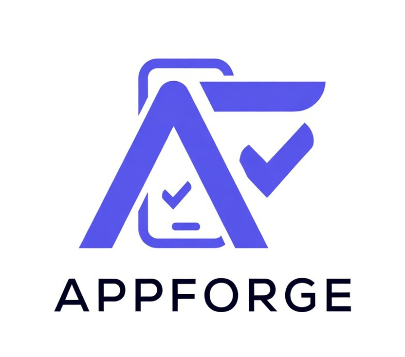

  

# 🏗️ AppForge | Mobile Automation MCP Server

A production-grade Model Context Protocol (MCP) server that empowers AI Assistants (like Claude, Gemini, or Antigravity) to act as expert **Mobile Automation Engineers**. 

This server bridges the gap between natural language test intent and executable, strictly-typed **Appium + WebdriverIO + Cucumber (BDD)** test suites using the **Page Object Model (POM)** architecture. It goes beyond simple code generation by offering **live device introspection, self-healing locators, test coverage analysis, and cross-platform native test migration.**

---

## 🌟 Core Capabilities

### 1. 🏗️ Intelligence-Driven Scaffolding
- Complete Appium/Cucumber `Node.js` project generation.
- Generates `tsconfig.json`, `cucumber.js`, `wdio.conf.ts`, `BasePage.ts`, and `MobileGestures.ts`.
- Configures Android UIAutomator2 and iOS XCUITest profiles out-of-the-box.

### 2. 🧠 Smart Test Generation
- Reads plain-English feature requests and outputs Gherkin `.feature` files alongside TypeScript Step Definitions and strictly-typed Page Objects.
- **AST-Powered Reuse**: Uses `ts-morph` to deeply scan your existing steps and page methods, aggressively preventing code duplication.
- **Platform-Aware**: Enforces `.android.ts` and `.ios.ts` split-POM design for cross-platform apps.

### 3. 📱 Live Device Introspection (Vision + XML)
- **Live Appium Connection**: Start a session with a connected Android emulator or iOS simulator.
- **Context-Aware Prompts**: Feed live device XML hierarchies and Base64 Vision Screenshots into the LLM context, ensuring the AI writes locators for elements that *actually exist* on the screen.

### 4. 🧰 Automated Self-Healing
- **Failure Analysis**: Interprets WebdriverIO stack traces and Appium errors.
- **Auto-Update**: Suggests fallback and optimal locators (prioritizing `accessibility-id`).
- **Auto-Learning**: Successfully verified heals are saved to a `.mcp-knowledge.json` brain. The MCP proactively injects this localized team knowledge into future generation prompts so the AI never makes the same mistake twice.

### 5. 🛠️ Advanced Tooling
- **Test Migration**: Convert legacy Espresso (Java), XCUITest (Swift), or Detox (JS) test files into Appium Cucumber TypeScript.
- **Coverage Analysis**: Heatmap metrics of your `.feature` footprint to find untested screens (including automated suggestions for Negative Scenario pathing and TalkBack/VoiceOver accessibility coverage).
- **Security & Hardening**: Built-in dry-run modes, atomic file backups before overwrites, AST syntax validation (`tsc --noEmit`), and safety audits catching `eval()` or leaked `.env` secrets.

---

## 📦 Installation & Setup

1. **Prerequisites**:
   * Node.js v18+
   * Custom MCP Client host (Cursor, Antigravity, Claude Desktop, etc.)
   * Java JDK / Android Studio / Xcode (depending on target platform)
   * Appium 2.x CLI globally installed (`npm install -g appium`)

2. **Bootstrapping the Server (via config)**:
Add the local server to your MCP Client settings:
\`\`\`json
{
  "mcpServers": {
    "appforge": {
      "command": "node",
      "args": ["/path/to/appium-cucumber-pom-mcp/dist/index.js", "--transport", "stdio"]
    }
  }
}
\`\`\`
*(Also supports SSE transport via `--transport sse --port 3100`)*

---

## 🛠️ MCP Tool Reference (26 Exposes)

### Project Setup & Maintenance
* \`setup_project\`: Bootstraps a scalable framework with hooks and standard structure.
* \`upgrade_project\`: Updates an existing repository to latest core dependencies and migrates configurations.
* \`manage_config\`: Reads/updates `mcp-config.json` capability builds and device routing.
* \`check_environment\`: Identifies missing Android SDKs, unbooted iOS simulators, or unreachable Appium servers.

### Codebase Intelligence & Generation
* \`analyze_codebase\`: AST-based extraction of existing Steps, Pages, and Helpers.
* \`generate_cucumber_pom\`: Heart of the machine. Generates the BDD suite instructions mapping English to POM code.
* \`validate_and_write\`: Syntactically validates TypeScript and Gherkin before committing writes safely to disk (with backup snapshots).
* \`migrate_test\`: Translates Native frameworks (Espresso/XCUITest) into Appium + Cucumber.

### Execution & Healing
* \`start_appium_session\` / \`end_appium_session\`: Triggers an active app session mapped to the LLM. 
* \`inspect_ui_hierarchy\`: Dumps the raw UI tree to find accurate Native/Flutter/React-Native node bounds.
* \`verify_selector\`: Real-time query against the active emulator verifying if the AI's proposed locator is truly visible.
* \`run_cucumber_test\`: Runs and formats Mocha/Cucumber output strings.
* \`self_heal_test\`: Feeds test failures and live screen context into the LLM to patch broken step definitions and locators.

### Advanced Quality Assurance
* \`analyze_coverage\`: Reports on missing core functional flows and negative tests.
* \`generate_test_data_factory\`: Bootstraps typed `faker.js` entity mockers.
* \`export_bug_report\`: Auto-classifies failures into Jira/Linear ready Markdown tickets with environment metadata.
* \`suggest_refactorings\`: Flags unused POM methods and Duplicate Step Definitions.

---

## 📝 Example AI Prompts

> *"I have a new login screen. Draft a BDD feature and the required iOS/Android Page Objects for an invalid password scenario. Use the live Appium session XML to find the exact login button ID."*

> *"The Checkout test is failing because the 'Submit Order' button locator changed. Heal the test using the attached vision screenshot and test stack trace, and remember this fix for the future."*

> *"Migrate this Espresso `LoginTest.java` file into an Appium Cucumber BDD suite. Ensure you enforce the cross-platform (.android.ts / .ios.ts) POM pattern."*

---

## 🔒 Safety First
* **Non-Destructive**: Revisions are safely backed up to `.appium-mcp/backups/`.
* **Idempotent Analysis**: AST parsing guarantees non-breaking detection of existing test artifacts. 

*(Built for enterprise scale AI workflows by abstracting the friction of mobile configuration and brittle selectors.)*
