# Multi-Modal Agentic QA Ecosystem: High-Level Conceptual Design

## 1. Executive Summary

This document outlines the high-level architecture for an **Agentic Quality Assurance Ecosystem** powered by **TestForge** and **AppForge**. The goal is to evolve test automation from a code-reactive process (analyzing what *is* built) to a multi-modal, intent-driven process (analyzing what *should be* built). 

By acting as the central intelligence hub, the Forge Agent synthesizes business requirements from Jira, visual design from Figma, and utilizes TestForge/AppForge to autonomously generate, propose, and execute test cases within the local codebase.

---

## 2. Core Integrations & Data Sources

The ecosystem relies on four primary pillars to build context before any automation code is written:

| System | Role | Data Extracted | Purpose |
| :--- | :--- | :--- | :--- |
| **Jira** | The Brain (Tasks) | User Stories, Epics, Acceptance Criteria. | Establishes the core feature requirements and definitions of done. |
| **Confluence** | The Memory (Context) | Product Requirement Docs (PRDs), API Contracts, Technical specs. | Provides deep architectural and business logic context often missing from brief Jira tickets. |
| **Figma** | The Eyes (Vision) | Frames, Prototypes, Component States, Interactive Flows. | Provides visual ground truth. The AI uses Vision Language Models (VLMs) to literally "see" expected layouts, error states, and user journeys. |
| **Xray** | The Output (Verification)| Test Cases, Test Sets, Execution Runs. | The structured destination where the AI pushes proposed Gherkin/BDD scenarios for traceability and execution tracking. |
| **TestForge / AppForge** | The Execution Engine (Action) | Test Scripts, Page Objects, Scaffolding. | Consumes the synthesized test plan and translates it into executable Playwright (TestForge) or Appium (AppForge) automation code, fully integrated with the project structure. |

---

## 3. The Bidirectional Workflow

The system operates in a continuous, bidirectional loop, ensuring that design, requirements, and tests remain synchronized.

```mermaid
sequenceDiagram
    participant User
    participant Forge Agent
    participant Jira/Confluence
    participant Figma
    participant Xray
    participant AppForge/TestForge

    User->>Forge Agent: "Generate test plan for Jira Ticket PROJ-102"
    
    rect rgb(20, 40, 60)
    Note over Forge Agent,Figma: Phase 1: Context Fetching
    Forge Agent->>Jira/Confluence: Fetch PROJ-102 (ACs) & linked PRD
    Jira/Confluence-->>Forge Agent: Return Requirements Data
    Forge Agent->>Figma: Fetch linked design frames (API)
    Figma-->>Forge Agent: Return UI Structure & States
    end
    
    rect rgb(20, 60, 40)
    Note over Forge Agent,User: Phase 2: Synthesis & Proposal
    Forge Agent->>Forge Agent: Analyze ACs + Visuals via VLM
    Forge Agent->>Forge Agent: Generate BDD Test Cases (Happy Path, Edge Cases)
    Forge Agent-->>User: Propose Test Plan (Review Required)
    User->>Forge Agent: Approve/Modify Plan
    end
    
    rect rgb(60, 40, 20)
    Note over Forge Agent,AppForge/TestForge: Phase 3: Sync & Execution Generation
    Forge Agent->>Xray: Push Approved Test Cases via API
    Xray-->>Forge Agent: Confirm Creation & Link to PROJ-102
    Forge Agent->>AppForge/TestForge: Trigger Code Generation for Test Scenarios
    AppForge/TestForge-->>Forge Agent: Return Playwright/Appium Step Defs & POMs
    Forge Agent-->>User: Codebase updated and ready for execution
    end
```

---

## 4. Extended Integrations (The "Ultimate Brain")

To move beyond functional testing into highly resilient, shift-left testing, the following integrations are proposed for Phase 2:

### A. Observability (Datadog / Sentry / Amplitude)
* **Goal:** Prioritized, risk-based test generation.
* **Mechanism:** The agent queries production traffic data and error logs. If Sentry highlights a frequent JS exception on a specific component, or Amplitude shows a high-conversion checkout flow, the agent automatically prioritizes deep regression tests for those specific areas.

### B. API Contracts (Swagger / GraphQL / Postman)
* **Goal:** Full-stack scenario generation.
* **Mechanism:** Instead of superficial UI tests, the agent understands the backend data shapes. It generates tests that intentionally mock specific backend error responses (e.g., `402 Payment Required`) to verify the Figma-defined error states in the UI.

### C. Local Workspace Analysis & Source Control
* **Goal:** Contextual deduplication.
* **Mechanism:** Using the native analysis capabilities of **TestForge** and **AppForge**, the agent scans the local workspace before generating tests. It parses the Abstract Syntax Tree (AST) to see if Step Definitions, Page Objects, or generic Mock Utilities already exist for the targeted feature. This local intelligence ensures tests reuse existing code modules instead of hallucinating new structures, independently of pushing or pulling from remote version control.

---

## 5. Technical Challenges & Considerations

Implementing this architecture requires solving several AI-specific orchestration challenges:

> [!WARNING]
> **Token & Context Limits**
> A single Jira ticket might link to a 20-page Confluence PRD, a large Swagger API spec, and heavy Figma image encodings. Passing all this raw data into a prompt will exceed token limits and cause model "hallucinations."
> * **Mitigation:** Implement an advanced **RAG (Retrieval-Augmented Generation)** or Map-Reduce pipeline. The agent should first summarize and extract *only* the data relevant to the specific testing goal before attempting to write scenarios.

> [!IMPORTANT]
> **Design vs. Code Drift (Stale State Resolution)**
> Figma designs frequently become outdated once development begins.
> * **Mitigation:** The AI must handle discrepancies gracefully. If the codebase has a `submit-btn` but Figma shows a `continue-btn`, the agent should prioritize the live code DOM while flagging the discrepancy to the developer for potential design-debt resolution.

> [!TIP]
> **VLM (Vision Language Model) Reliability**
> Figma API returns JSON representations of nodes, but to truly understand layout, visual rendering (screenshots) must be passed to a VLM (like GPT-4o or Gemini 1.5 Pro). The system needs robust prompting to ensure the VLM accurately maps visual elements to semantic test steps.

---

## 6. Next Steps for Prototyping

1. **Build the Integration Bridges:** Develop minimal MCP (Model Context Protocol) servers for Jira, Xray, and Figma.
2. **Define the Prompt Chain:** Create a multi-agent workflow where Agent A fetches and summarizes requirements, Agent B analyzes Figma visuals, and Agent C writes the Gherkin scenarios.
3. **Pilot on a Simple Feature:** Run the workflow on a single, well-defined Jira ticket (e.g., a "Forgot Password" flow) to validate the end-to-end sync to Xray.
