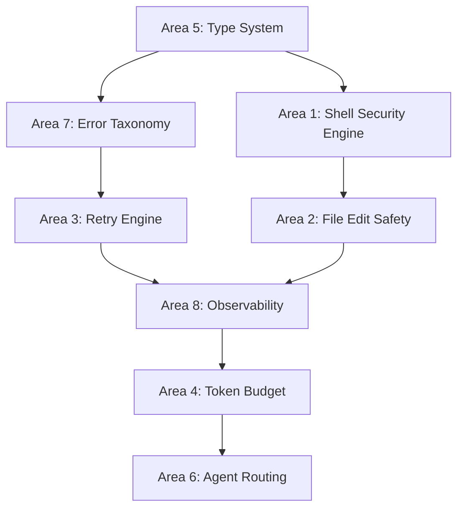

# 🏆 Gold Standard Plan: AppForge & TestForge

*Gap analysis against `claude-code-main` and `openclaude-main` with concrete implementation tasks.*

---

## Current State Summary

| Layer | AppForge | TestForge |
|---|---|---|
| Services | 24 files, well-structured | 47 files (incl. compiled), comprehensive |
| Utils | 8 files (SecurityUtils, ErrorFactory, etc.) | 5 utils, leaner |
| Types | 1 file (`Response.ts`) — **severely thin** | No dedicated types dir |
| Tests | 22 test files, good security coverage | 47 files, mixed compile/source |
| Security | Path traversal + basic shell sanitization | Similar, copied pattern |
| Token Awareness | ❌ None | ❌ None |
| Retry Logic | ❌ None | ❌ None |
| File Edit Safety | ❌ Basic string replace | ❌ Basic string replace |

---

## 🔴 Area 1: Shell Security — Critical Upgrade (`bashSecurity.ts`)

### Problem
Our current `SecurityUtils.sanitizeForShell()` strips characters with a regex. Claude Code's `bashSecurity.ts` is **a 2,500-line production-hardened security engine** covering:
- Quote desync attacks, Zsh-specific bypasses (`zmodload`, `emulate`, `zpty`, `ztcp`)
- Heredoc injection, unicode whitespace tricks, brace expansion, IFS injection
- Command substitution patterns `$()`, `` ` ``, `=cmd` Zsh equals expansion

### What We Have
```typescript
// AppForge/src/utils/SecurityUtils.ts
const SHELL_DANGEROUS_CHARS = /[;&|`$(){}!<>\\]/g;
export function sanitizeForShell(input: string): string {
  return input.replace(SHELL_DANGEROUS_CHARS, '').trim();
}
```

### What Claude Code Has
- 23 named security check IDs (numeric, for telemetry)
- `COMMAND_SUBSTITUTION_PATTERNS` array with 11 patterns
- `ZSH_DANGEROUS_COMMANDS` Set (16 builtins)
- `ValidationContext` type carrying parsed, quoted, and unquoted variants
- Chain-of-responsibility validator pipeline: each function returns `PermissionResult` (`allow | ask | passthrough | block`)

### Implementation Plan
1. **Create `ShellSecurityEngine.ts`** in both `AppForge/src/utils/` and `TestForge/src/utils/`
   - Port the `ValidationContext` type, `PermissionResult` enum, and core validator chain
   - Add the `ZSH_DANGEROUS_COMMANDS` Set
   - Add all `COMMAND_SUBSTITUTION_PATTERNS`
   - Replace `sanitizeForShell()` with a proper `validateShellCommand(cmd): PermissionResult`
2. **Reference file:** `c:\Users\Rohit\mcp\claude-code-main\src\tools\BashTool\bashSecurity.ts`

---

## 🔴 Area 2: File Edit Safety — Quote Normalization + Atomic Patches

### Problem
`FileWriterService.ts` in both repos uses raw `fs.writeFileSync` or simple string replace with no idempotency, trailing-whitespace normalization, curly-quote handling, or patch generation.

### What Claude Code Has (`FileEditTool/utils.ts`)
- `normalizeQuotes()` — handles curly/smart quotes from LLM output → straight quotes
- `preserveQuoteStyle()` — preserves file's original quote style after edit
- `applyEditToFile()` — `replace` vs `replaceAll` with trailing newline strip
- `getPatchForEdits()` — returns structured `StructuredPatchHunk[]` (diff) + updated content
- **Critically**: throws `'String not found in file'` rather than silently failing
- `areFileEditsEquivalent()` — semantic edit comparison (two edits may produce same result)

### Implementation Plan
1. **Upgrade `FileWriterService.ts`** in both repos:
   - Add `normalizeQuotes()` before every string-match operation
   - Add `stripTrailingWhitespace()` on generated code before writing
   - Wrap all edit writes with a `try/finally` to handle partial writes
   - Return structured diff alongside written file path
2. **Reference file:** `c:\Users\Rohit\mcp\claude-code-main\src\tools\FileEditTool\utils.ts`

---

## 🟠 Area 3: Retry Logic with Exponential Backoff (`withRetry.ts`)

### Problem
AppForge and TestForge have zero retry logic. Any transient Appium/Playwright session failure causes immediate tool failure. The user gets an error. No recovery.

### What OpenClaude Has (`services/api/withRetry.ts` — 30KB)
- Typed `RetryPolicy` config: `maxAttempts`, `baseDelayMs`, `maxDelayMs`, `jitter`, `retryOn[]`
- HTTP status code–aware retry (429 rate-limit, 5xx server errors → retry; 4xx client errors → don't)
- Exponential backoff with full jitter
- `RetryContext` passed to each attempt so callers can log attempt number

### Implementation Plan
1. **Create `RetryEngine.ts`** in `AppForge/src/utils/` and `TestForge/src/utils/`
   - Define `RetryPolicy` type (maxAttempts, backoff strategy, retryOn conditions)
   - Implement `withRetry<T>(fn: () => Promise<T>, policy: RetryPolicy): Promise<T>`
   - Apply to: Appium `startSession`, Playwright `startSession`, file write operations
2. **Reference file:** `c:\Users\Rohit\mcp\openclaude-main\src\services\api\withRetry.ts`

---

## 🟠 Area 4: Token Budget & Cost Tracking (`cost-tracker.ts`)

### Problem
Both MCP servers have no awareness of how many tokens tool calls are consuming. This violates User Rule #1 (Token-Aware Planning) and means recursive or large sandbox operations can silently consume huge context windows.

### What Claude Code Has (`cost-tracker.ts`)
- `ModelUsage` type: `inputTokens`, `outputTokens`, `cacheReadInputTokens`, `costUSD`, `contextWindow`
- `addToTotalSessionCost()` — accumulates per-model usage
- `saveCurrentSessionCosts()` / `getStoredSessionCosts()` — persists across sessions
- `formatTotalCost()` — human-readable summary string for logging

### Implementation Plan
1. **Create `TokenBudgetService.ts`** in both repos:
   - Simple per-tool-call token estimation (based on input char count / 4 as rough estimate)
   - `ToolInvocationRecord` type: `{ tool, inputEstimate, outputEstimate, timestamp }`
   - Per-session accumulator, flushed on MCP server shutdown
   - Log a `⚠️ TOKEN BUDGET WARNING` when total exceeds configurable threshold
   - Expose `getSessionTokenSummary()` for debug logging
2. **Reference files:** `claude-code-main/src/cost-tracker.ts`, `claude-code-main/src/services/tokenEstimation.ts`

---

## 🟠 Area 5: Type System Expansion — From 1 File to a Full Domain Model

### Problem
AppForge has `src/types/Response.ts` with literally one type. TestForge has no types directory at all. This leads to scattered `any` usage and LLM-generated code that's schema-unsafe.

### What Claude Code Has
- `Tool.ts` (~29K lines) — a complete tool contract system with `InputSchema`, `PermissionModel`, `ExecutionState`
- Separate type files per domain: `Task.ts`, `QueryEngine.ts` type exports
- Zod schemas co-located with types for runtime validation

### Implementation Plan
1. **AppForge `src/types/` expansion** (create these files):
   - `AppiumTypes.ts` — `SessionConfig`, `DeviceCapabilities`, `InspectionResult`, `HealCandidate`
   - `TestGenerationTypes.ts` — `FeatureFile`, `PageObject`, `StepDefinition`, `GenerationRequest`
   - `McpToolResult.ts` — unified `{ success, data, error, metadata }` response envelope
   - `PermissionResult.ts` — port from Claude Code: `allow | ask | block | passthrough`
2. **TestForge `src/types/` creation** (mirror pattern)
3. **Reference:** `claude-code-main/src/Tool.ts` for schema patterns, `AppForge/src/types/Response.ts` as seed

---

## 🟡 Area 6: Agent Routing for Multi-Model Orchestration

### Problem
AppForge always uses whatever model the client sends. It doesn't differentiate between cheap tasks (checking if file exists) and expensive tasks (full test generation, self-healing).

### What OpenClaude Has (`src/services/api/agentRouting.ts`)
- `AgentRoutingConfig` map: `{ [taskName: string]: modelId }`
- `resolveModelForTask(taskName, routingConfig)` — returns model name to use
- Fallback to `default` key if no match

### Implementation Plan
1. **Add agent routing hints to `mcp-config.json` schema** in both AppForge and TestForge:
   ```json
   "agentRouting": {
     "generate_test": "claude-sonnet",
     "self_heal": "claude-opus",
     "analyze_codebase": "claude-haiku",
     "default": "claude-sonnet"
   }
   ```
2. **Add `getModelForTool(toolName: string): string`** in `McpConfigService.ts` for both repos
3. Surface this in tool response metadata so the calling LLM knows which model was used
4. **Reference file:** `c:\Users\Rohit\mcp\openclaude-main\src\services\api\agentRouting.ts`

---

## 🟡 Area 7: Structured Error Taxonomy (`errors.ts`)

### Problem
AppForge has `ErrorFactory.ts` (2KB), `Errors.ts` (1.5KB), `ErrorHandler.ts` (1.3KB) — three files duplicating concerns. OpenClaude's `errors.ts` is **42KB** — a full production taxonomy.

### What OpenClaude Has (`services/api/errors.ts`)
- Error class hierarchy: `ApiError`, `AuthError`, `RateLimitError`, `NetworkError`, `ParseError`
- Each error has: `code` (string enum), `httpStatus`, `retryable` boolean, `userMessage`
- `errorUtils.ts` — `isRetryableError()`, `formatErrorForUser()`, `wrapError()`
- Structured serialization for passing errors across MCP boundaries

### Implementation Plan
1. **Consolidate AppForge's 3 error files into 1 `ErrorSystem.ts`:**
   - Define `McpErrorCode` enum with semantic names (e.g., `SESSION_TIMEOUT`, `FILE_NOT_FOUND`, `SCHEMA_VALIDATION_FAILED`)
   - Create `McpError extends Error` with `code`, `retryable`, `toolName`, `httpStatus`
   - Add `isRetryableError()`, `toMcpResponse()` helpers
   - Delete `ErrorFactory.ts`, `ErrorHandler.ts`, `Errors.ts` after migration
2. **Mirror in TestForge** (which currently only has `ErrorCodes.ts`)
3. **Reference:** `c:\Users\Rohit\mcp\openclaude-main\src\services\api\errors.ts`

---

## 🟡 Area 8: Observability — Structured Tool Logging

### Problem
Both servers log to `console.error()` and `console.log()`. There's no structured per-tool execution log, no timing data, and no way to trace a multi-step repair loop.

### What Claude Code Has
- `src/services/analytics/` — `logEvent(name, attrs)` sends structured events
- `src/utils/log.ts` — `logError(err)` serializes the full stack trace
- `src/services/diagnosticTracking.ts` — session-level diagnostic events with timing
- Every tool call gets a `tool_use_start` + `tool_use_end` event with duration

### Implementation Plan
1. **Create `ObservabilityService.ts`** in both repos:
   - `toolStart(toolName, inputSummary): string` — returns traceId
   - `toolEnd(traceId, success, outputSummary, durationMs): void`
   - `logToolError(traceId, error): void` — serializes error with stack
   - Writes to `mcp-logs/{date}.jsonl` (newline-delimited JSON) in the project root
   - Integrate into every MCP tool handler via the existing `safeExecute` middleware
2. **Reference:** `claude-code-main/src/utils/log.ts`, `claude-code-main/src/services/analytics/`

---

## 📋 Implementation Priority & Sequencing



| Priority | Area | Effort | Impact |
|---|---|---|---|
| P0 | #5 Type System | Low (new files) | Unlocks all others |
| P0 | #7 Error Taxonomy | Medium (refactor) | Foundation for retry + observability |
| P1 | #1 Shell Security | High (port complex logic) | Critical security hardening |
| P1 | #2 File Edit Safety | Medium | Prevents silent data corruption |
| P1 | #3 Retry Engine | Low-Medium (new util) | Immediate reliability boost |
| P2 | #8 Observability | Medium | Transforms debuggability |
| P2 | #4 Token Budget | Low (new util) | Enforces Rule #1 |
| P3 | #6 Agent Routing | Low (config + lookup) | Cost optimization |

---

## Reference Index

| Feature | Source File |
|---|---|
| Shell Security Engine | `claude-code-main/src/tools/BashTool/bashSecurity.ts` |
| File Edit Safety | `claude-code-main/src/tools/FileEditTool/utils.ts` |
| Retry with Backoff | `openclaude-main/src/services/api/withRetry.ts` |
| Token/Cost Tracking | `claude-code-main/src/cost-tracker.ts` |
| Token Estimation | `claude-code-main/src/services/tokenEstimation.ts` |
| Agent Routing | `openclaude-main/src/services/api/agentRouting.ts` |
| Error Taxonomy | `openclaude-main/src/services/api/errors.ts` + `errorUtils.ts` |
| Structured Logging | `claude-code-main/src/utils/log.ts` |
| Analytics Events | `claude-code-main/src/services/analytics/` |
| Tool Type Contract | `claude-code-main/src/Tool.ts` |
| Provider Config | `openclaude-main/src/services/api/providerConfig.ts` |
