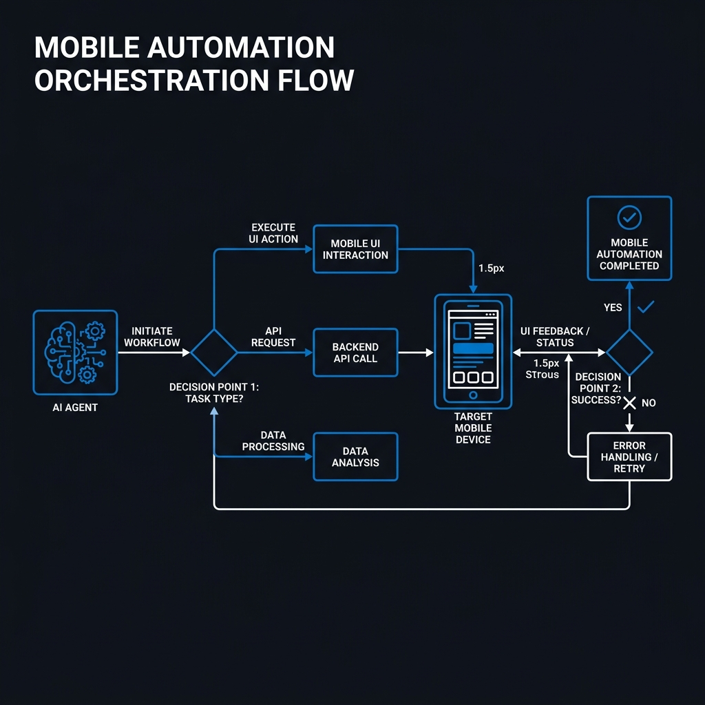

import { Card, CardGrid, Badge } from '@astrojs/starlight/components';

## 🧬 The Orchestration DNA <Badge text="Agent-Optimized" variant="success" />

AppForge transforms mobile quality assurance into a **Thinking Engine** for AI agents, providing the architectural foundation for autonomous testing environments.

<CardGrid stagger>
	<Card title="Autonomous Healing" icon="heart">
		When selectors break, AppForge doesn't. It uses **Atomic Orchestration** to re-scan the live hierarchy, identify the updated element via fuzzy matching, and fix your Page Objects in real-time.
	</Card>
	<Card title="Turbo-Sandbox Analysis" icon="rocket">
		Achieve a **90% reduction in token usage**. Our local V8 engine processes massive XML structures and codebase ASTs locally, sending only synthesized "Core Insights" to the LLM. 
	</Card>
	<Card title="Architectural Awareness" icon="shield-check">
		AppForge is architecturally-aware. It mandates the **Page Object Model (POM)** pattern and prevents 'spaghetti logic' by validating all generated code against your custom structural brain.
	</Card>
	<Card title="Semantic Extraction" icon="magnifier">
		Built for stability. AppForge prioritizes **Accessibility IDs** and functional roles, making your mobile automation resilient to visual UI changes and platform updates.
	</Card>
</CardGrid>

 

## 🛠️ Performance & Compliance

Built for the scale of enterprise teams.

<CardGrid stagger>
	<Card title="Zero-Config CI/CD" icon="rocket">
		Pre-built workflows for **GitHub Actions** and **GitLab**. Automated DNA failure analysis and Jira-ready bug reporting out of the box.
	</Card>
	<Card title="Secure Execution" icon="shield">
		All sandbox operations run in an isolated memory space. Your local system, credentials, and app binaries stay protected inside a secure boundary.
	</Card>
	<Card title="Legacy Translation" icon="document">
		Migrate entire suites from **Espresso, XCUITest, or Detox** to the unified Appium-Cucumber stack with the `migrate_test` toolchain.
	</Card>
	<Card title="Telemetry Fidelity" icon="random">
		Real-time synchronization of UI state, screenshots, and XML hierarchies, providing the AI with "Perfect Vision" of the application state.
	</Card>
</CardGrid>

 

## High-Level Orchestration

 

:::tip[Ready to transform your QA?]
Join the future of orchestrated mobile automation. AppForge is currently in early access for enterprise engineering teams.
[Get Started Today](./repo/user/userguide/)
:::

---

**Orchestrate your mobile future. 🚀**
