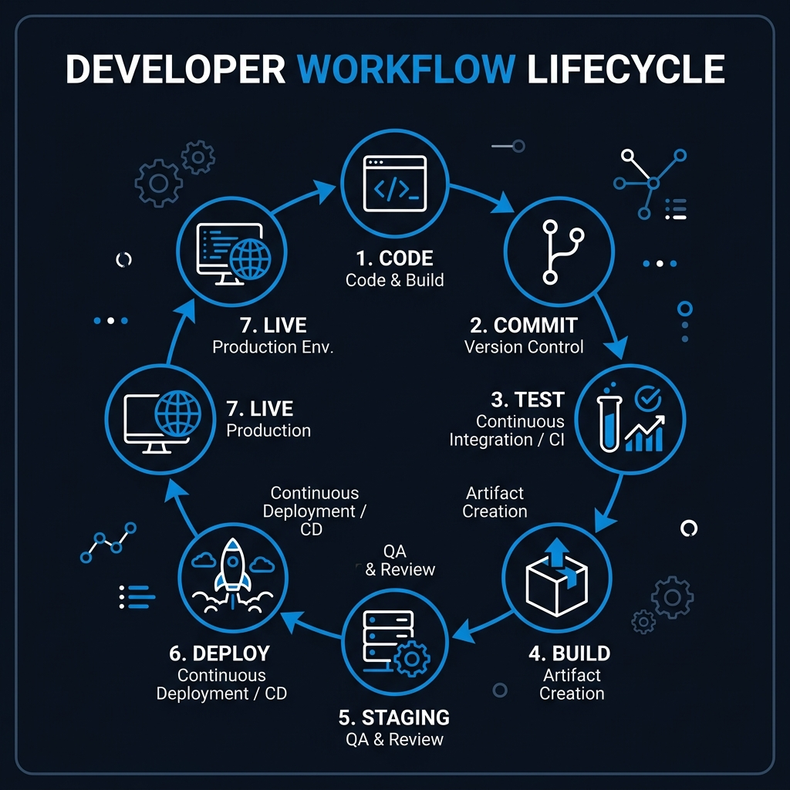

import { Steps, Aside, Card, CardGrid, Badge } from '@astrojs/starlight/components';

Automation is only as valuable as its **Pipeline Reliablity**. AppForge ensures your mobile tests integrate seamlessly into your enterprise CI/CD workflows with "Zero-Hand-Holding" orchestration.

<div class="hero-bg-accent"></div>

---

## 🏗️ 1. Infrastructure-as-Prompt

AppForge automates the generation of optimized pipeline configurations (`generate_ci_workflow`) by mapping your local environment directly to cloud YAML.



### Core Capabilities
- **Dynamic Interception**: Reads your `mcp-config.json` to configure the correct Node.js, Appium, and build paths.
- **Boot Management**: Scaffolds the logic to start Appium and boot target emulators/simulators within the ephemeral CI agent.
- **Provider Support**: Out-of-the-box support for **GitHub Actions** and **GitLab CI**.

<details>
<summary>Technical Specs: GitHub Action Workflow</summary>
The generated workflow includes optimized caching for `node_modules` and Appium drivers, reducing cold-boot times by up to 60%.

```yaml
# Generated by generate_ci_workflow
steps:
  - uses: actions/checkout@v4
  - uses: actions/setup-node@v4
  - name: Install Dependencies
    run: npm install
  - name: Run AppForge Smoke Tests
    run: npx appforge run --tags "@smoke"
```
</details>

---

## 🐛 2. High-Fidelity Bug Reporting

When a pipeline fails, `export_bug_report` generates **DNA-Level Error Classification** reports ready for Jira or Slack.

<CardGrid stagger>
    <Card title="Reproduction DNA" icon="document">
        Captures the exact Gherkin scenario and line-by-line steps that failed.
    </Card>
    <Card title="Environmental Snapshot" icon="random">
        Dumps OS versions, device profiles, and driver capabilities at the moment of failure.
    </Card>
    <Card title="Visual Evidence" icon="setting">
        Automatic capture and artifact uploading of screenshots and Appium telemetry logs.
    </Card>
    <Card title="Fix Suggestion" icon="pencil">
        High-confidence remediation based on the `StructuralBrain` analysis.
    </Card>
</CardGrid>

---

## 🔒 3. Cloud Infrastructure Parity

AppForge is designed for native integration with enterprise cloud device farms.

- **Vaulting**: Use `set_credentials` to manage API keys securely in your environment without code leakage.
- **Capability Profiles**: Switching from local emulators to BrowserStack or SauceLabs is an atomic operation—just update the `capabilitiesProfile` in your configuration.

---

## 🧠 4. CI/CD Knowledge Audit

<details>
<summary>**Q1: Should I run all tests on every Pull Request?**</summary>
**Pro Hint**: For speed, run a pruned `@smoke` suite on PRs. Use the full suite for your nightly `develop` or `main` builds.
</details>

<details>
<summary>**Q2: How does AppForge handle flakiness in CI?**</summary>
**Answer**: By using **Atomic Healing**. If a test fails in CI due to a UI change, the healer can suggest a fix in the job logs, allowing developers to apply the patch instantly.
</details>

---

:::tip[Pipeline Mastery]
In CI environments, always run with the `--clean` flag. This ensures a fresh `StructuralBrain` sync from the latest codebase, preventing stale cache errors.
:::

---

**Orchestrate your production quality. 🚀**
